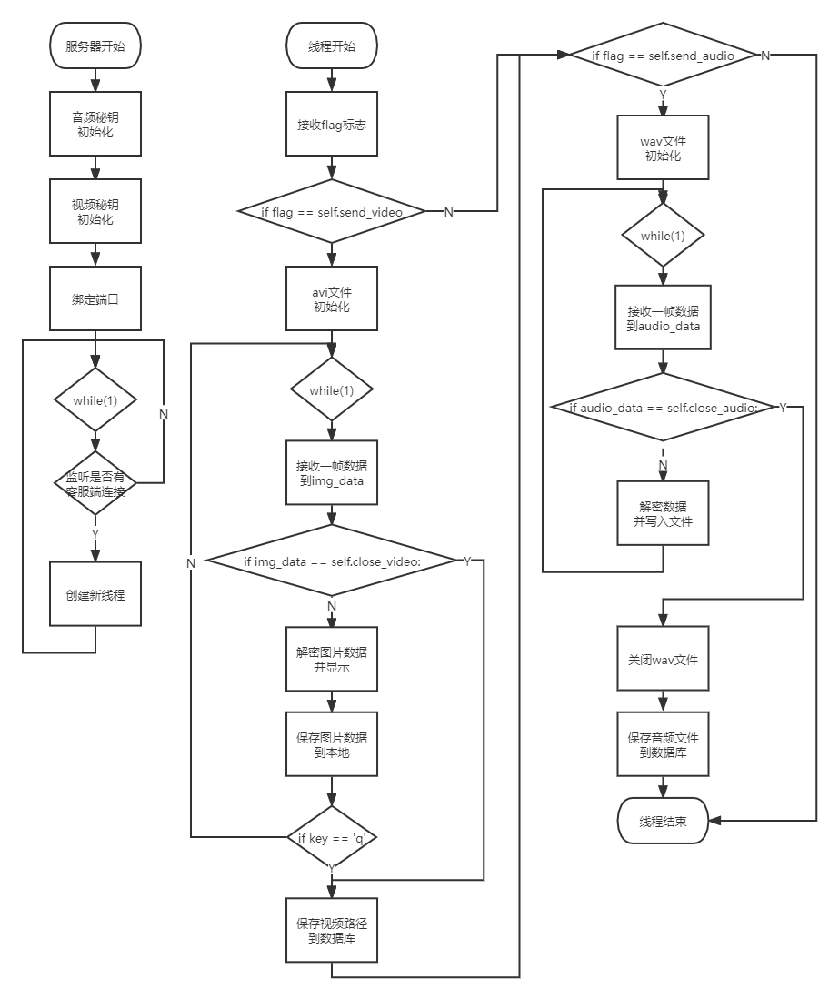
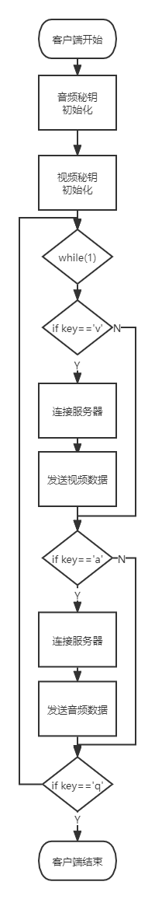

## 简介
----

```
#    Copyright (C) 2022  Enterprise0
#
#    This program is free software: you can redistribute it and/or modify
#    it under the terms of the GNU General Public License as published by
#    the Free Software Foundation, either version 3 of the License, or
#    (at your option) any later version.
#
#    This program is distributed in the hope that it will be useful,
#    but WITHOUT ANY WARRANTY; without even the implied warranty of
#    MERCHANTABILITY or FITNESS FOR A PARTICULAR PURPOSE.  See the
#    GNU General Public License for more details.
#
#    You should have received a copy of the GNU General Public License
#    along with this program.  If not, see <https://www.gnu.org/licenses/>.
```

合肥工业大学电信工信息系统软件设计

记录源码，`仅供参考`。

## 题目
----

题目三，流媒体加密传输软件：完成音频和视频（二者皆有）的采集、加密或加水印、传输、解密或提取水印、存储（必须基于数据库）

## 流程图
----
详见./pic，仅供参考，可能有修改。



